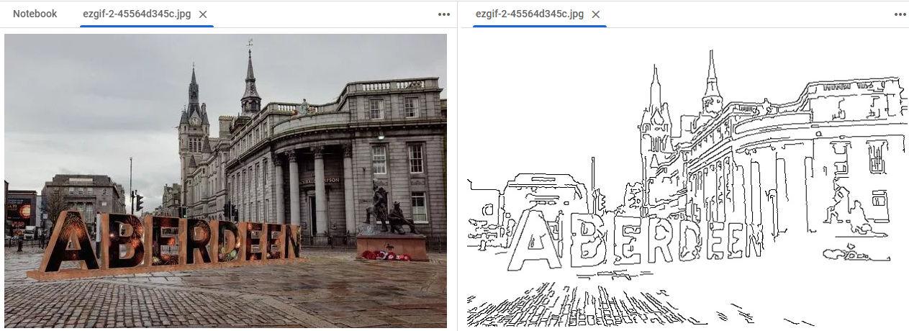

# Project Overview 🎨

Creating an AI tool that converts my own images into coloring pages using edge detection and image processing techniques. This project aims to explore advanced AI applications for personalised and enhanced artistic creation.

## Objectives 🖌️

1. **Basic Colouring Page Generation**:
   - Convert images into basic line art for coloring pages.
   
2. **Creative Line Art Generation**:
   - Develop a model for creative line art using public datasets.

3. **Personalized Line Art Generation**:
   - Train a model on the my own doodles to reflect my style and explore potential.

## Learning Goals 📚

- **Image Processing Techniques**:
  - Implement grayscale conversion, Gaussian blurring, and Canny edge detection using OpenCV.
  
- **AI and Machine Learning in Art**:
  - Explore AI's role in analysing and replicating artistic styles.
  - Learn about creating personalised AI models based on individual artists' work.

- **Impact of AI on Artistic Creation**:
  - Investigate how AI can augment, not replace, the creative process by identifying patterns and techniques in an artist's work.

## Ideal Outcome 🌟

Develop a comprehensive AI tool enabling artists to create personalised AI models. These models can generate new artworks or enhance existing ones, allowing artists to explore and expand their creative potential.

## Potential Impact 🚀

### For Artists:
- Empower artists to explore creative potential through AI.
- Provide tools to analyse and improve techniques.
- Enable creation of personalised, AI-generated artworks.

### For the Creative Industry:
- Enhance the quality and appeal of visual content.
- Provide insights into what makes certain artworks resonate with audiences.
- Open new avenues for interactive and personalised artistic experiences.

## Papers I Am Reading For This Project!

1. [An Image is Worth More Than 16x16 Patches: Exploring Transformers on Individual Pixels](https://huggingface.co/papers/2406.09415)
   - **Authors:** Duy-Kien Nguyen, Mahmoud Assran, Unnat Jain, Martin R. Oswald, Cees G. M. Snoek, Xinlei Chen
   - **Year:** 2024

2. [Unpaired Image-to-Image Translation using Cycle-Consistent Adversarial Networks](https://arxiv.org/pdf/1703.10593)
   - **Authors:** Zhu, Jun-Yan and Park, Taesung and Isola, Phillip and Efros, Alexei A.
   - **Booktitle:** Computer Vision (ICCV), 2017 IEEE International Conference on
   - **Year:** 2017

3. [Image-to-Image Translation with Conditional Adversarial Networks](https://arxiv.org/pdf/1611.07004)
   - **Authors:** Isola, Phillip and Zhu, Jun-Yan and Zhou, Tinghui and Efros, Alexei A.
   - **Booktitle:** Computer Vision and Pattern Recognition (CVPR), 2017 IEEE Conference on
   - **Year:** 2017

